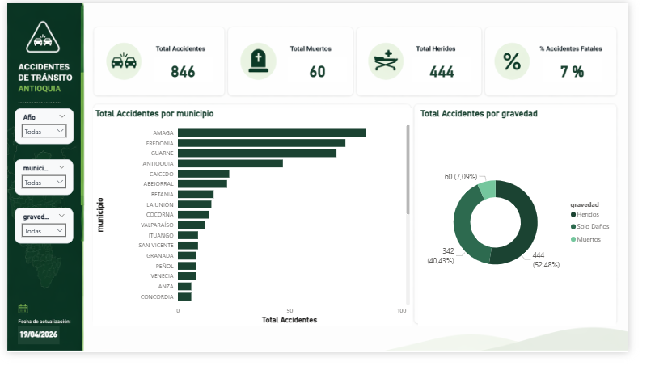
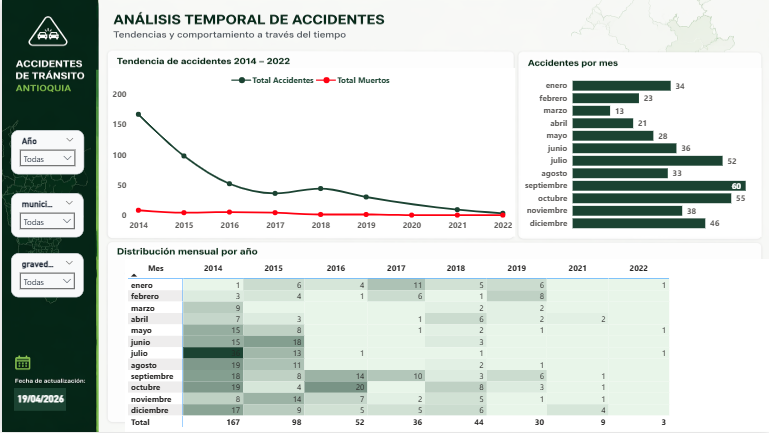
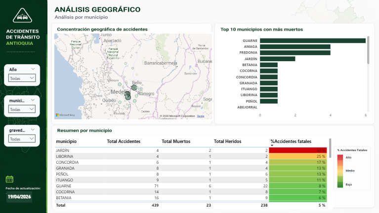
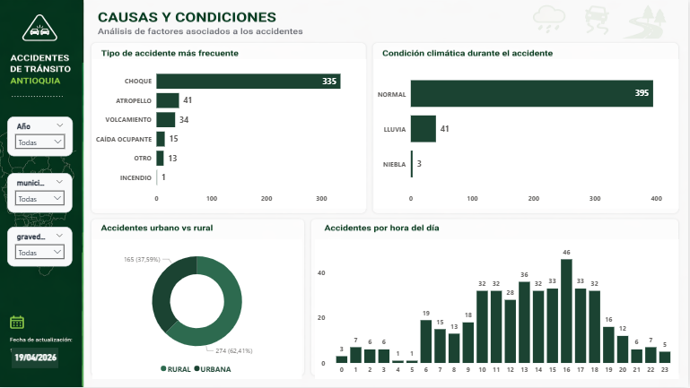

# 🚗 Análisis de Accidentalidad Vial en Antioquia (2014–2022)

## 📌 Descripción
Dashboard interactivo de análisis de accidentes de tránsito 
reportados en municipios bajo convenio con la Gerencia de 
Seguridad Vial de Antioquia, construido en Power BI con datos 
oficiales del gobierno colombiano.

## 🎯 Objetivo
Identificar patrones de accidentalidad vial en Antioquia para 
apoyar la toma de decisiones en seguridad vial a nivel municipal.

## 📊 Hallazgos principales
- **439 accidentes** registrados entre 2014 y 2022
- **El 76% son choques** — el tipo de accidente más frecuente
- **2014 fue el año más crítico** con 167 accidentes, 
  casi el doble que cualquier otro año
- **Las horas más peligrosas son entre las 14:00 y las 18:00**
- **Septiembre y julio** concentran la mayor accidentalidad mensual
- **El 90% ocurre con clima normal** — el clima no es el 
  factor determinante
- **Jardín tiene la tasa de mortalidad más alta** con 50% 
  de accidentes fatales
- **2020 registró una caída drástica** — posiblemente por las 
  restricciones de movilidad por COVID-19

## ⚠️ Limitaciones del dataset
El dataset excluye municipios con sistemas de reporte propios 
como Medellín, Envigado, Bello y Sabaneta. Los hallazgos 
representan únicamente los municipios bajo convenio con la 
Gerencia de Seguridad Vial de Antioquia.

Varias columnas presentan valores "No reportado", lo que 
evidencia gaps en el sistema de registro vial departamental.

## 🛠️ Herramientas utilizadas
- **Power BI Desktop** — visualización y dashboard
- **Power Query (M)** — limpieza y transformación de datos
- **DAX** — medidas y métricas calculadas
- **OData** — conexión directa a datos abiertos

## 📁 Fuente de datos
Datos Abiertos Colombia — Gerencia de Seguridad Vial de Antioquia  
[datos.gov.co](https://www.datos.gov.co)

## 📷 Capturas del dashboard
### Resumen General

### Análisis Temporal

### Análisis Geográfico

### Causas y Condiciones

## 👤 Autor
Camilo Roman  
[LinkedIn]()
